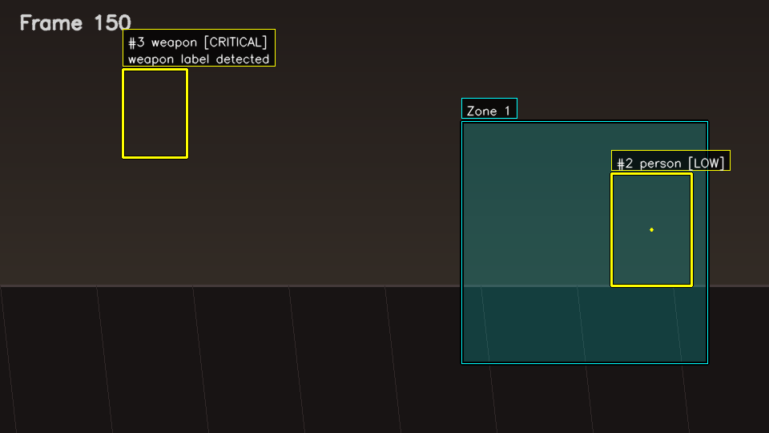

# Real-Time Surveillance and Threat Detection System

Deterministic real-time pipeline for object detection, tracking, and threat analysis with reproducible outputs.

## Demo

<video src="assets/demo.mp4" controls></video>

Live run showing tracking IDs, threat detection, and restricted zone behavior.

## Visual Output


Persistent tracking with stable IDs.



High-threat detection rendered in red.


Restricted zone overlay with entry and presence behavior.

## Key Features

- YOLOv8-based object detection
- DeepSORT-based identity tracking
- Deterministic threat engine for loitering and zones
- Optional runtime visualization
- JSONL event logging

## Why This Project Is Different

- Deterministic core that is testable without models
- Import-safe runtime adapters
- Clean modular pipeline design

## Architecture

Video -> Detection -> Tracking -> Threat Engine -> Alerts -> Visualization

## Visualization

- Color-coded threat levels
- Labeled tracks
- Zone overlays
- Optional trails

## Event Logging

Event logging uses JSON Lines, with one event per line and a fixed schema:

- `timestamp`
- `event_id`
- `track_id`
- `label`
- `level`
- `reason`
- `bbox`

Example lines from `assets/sample_events.jsonl`:

```json
{"bbox": [115, 280, 225, 440], "event_id": "loitering-1-30.0", "label": "loitering", "level": "medium", "reason": "track observed for 30.0s; movement=0.0px", "timestamp": 30.0, "track_id": 1}
{"bbox": [527, 216, 627, 356], "event_id": "zone-entry-2-0-86.0", "label": "zone_entry", "level": "high", "reason": "track entered restricted zone 0", "timestamp": 86.0, "track_id": 2}
```

## Reproducible Demo

Regenerate the demo outputs with:

```bash
python scripts/generate_demo_assets.py
```

This regenerates:
- `assets/demo.mp4`
- `assets/tracking.png`
- `assets/weapon.png`
- `assets/zone.png`
- `assets/sample_events.jsonl`

No manual setup is required beyond the runtime dependencies.

## Quick Start

Local validation:

```bash
pip install -r requirements.txt
pytest
```

Runtime:

```bash
pip install -r requirements-runtime.txt
python main.py --source 0
```

## Future Improvements

- Add a short screen-capture preview alongside the MP4 demo
- Refine overlay typography and zone labeling
- Add additional export formats for event logs
- Add optional alert delivery integrations
- Add benchmark reporting for runtime throughput
