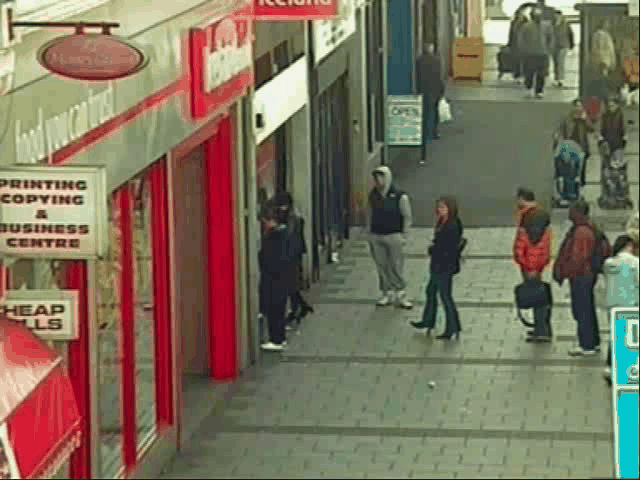
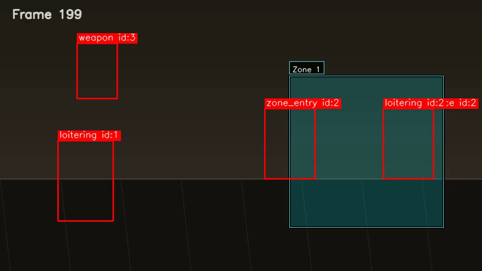

# Real-Time Surveillance and Threat Detection System

Deterministic pipeline for object detection, multi-object tracking, and rule-based threat analysis. The repository includes a runtime mode that optionally renders visualization overlays and writes JSONL event logs.

## Demo



[Download full video](assets/demo_video.mp4)

## Visual Output


Caption: Object tracking with persistent IDs


Caption: Zone-based monitoring (if visible)



Caption: Example alert or annotated detection frame

## Key Features

- Real-time object detection (YOLOv8)
- Multi-object tracking (DeepSORT)
- Rule-based threat detection (loitering, zones)
- Visualization overlays and JSONL event logging

## Why This Project Is Different

- Deterministic core logic (fully testable)
- Import-safe architecture (models & heavy deps loaded at runtime)
- Modular pipeline design for easy adapters and testing

## Architecture

Video → Detection → Tracking → Threat Engine → Alerts → Visualization

## Event Logging

Events are written as JSON Lines (one JSON object per line). Each event uses the following fields:

- `timestamp` — seconds since start
- `event_id` — unique event identifier
- `track_id` — numeric track identifier assigned by the tracker
- `label` — event label (e.g. `loitering`, `zone_entry`, `weapon`)
- `level` — event severity (e.g. `medium`, `high`, `critical`)
- `reason` — short human-readable explanation
- `bbox` — bounding box `[x1, y1, x2, y2]`

Example lines from `assets/sample_events.jsonl` (real output):

```json
{"bbox": [115, 280, 225, 440], "event_id": "loitering-1-30.0", "label": "loitering", "level": "medium", "reason": "track observed for 30.0s; movement=0.0px", "timestamp": 30.0, "track_id": 1}
{"bbox": [527, 216, 627, 356], "event_id": "zone-entry-2-0-86.0", "label": "zone_entry", "level": "high", "reason": "track entered restricted zone 0", "timestamp": 86.0, "track_id": 2}
```

## Reproducible Demo

To process a video and produce the annotated outputs used above:

```bash
python main.py --source assets/input_video.mp4
```

This run will (depending on `config.settings`) render overlays and write:

- `assets/demo_video.mp4` — annotated video (generated by pipeline)
- `assets/tracking.png` — tracking screenshot (extracted from demo_video.mp4)
- `assets/zone.png` — zone screenshot (extracted from demo_video.mp4)
- `assets/alert.png` — alert/annotated frame (extracted from demo_video.mp4)
- `assets/sample_events.jsonl` — event log (JSONL produced by the threat engine)

## Quick Start

Install test deps and run unit tests:

```bash
pip install -r requirements.txt
pytest
```

Install runtime dependencies and run on a camera:

```bash
pip install -r requirements-runtime.txt
python main.py --source 0
```

## Notes

- The README and demo use only generated assets from the `assets/` folder.
- The system reports only actual detections and events recorded during the run.
- Optional offline violence detection using Roboflow video inference (enabled via `.env`).

